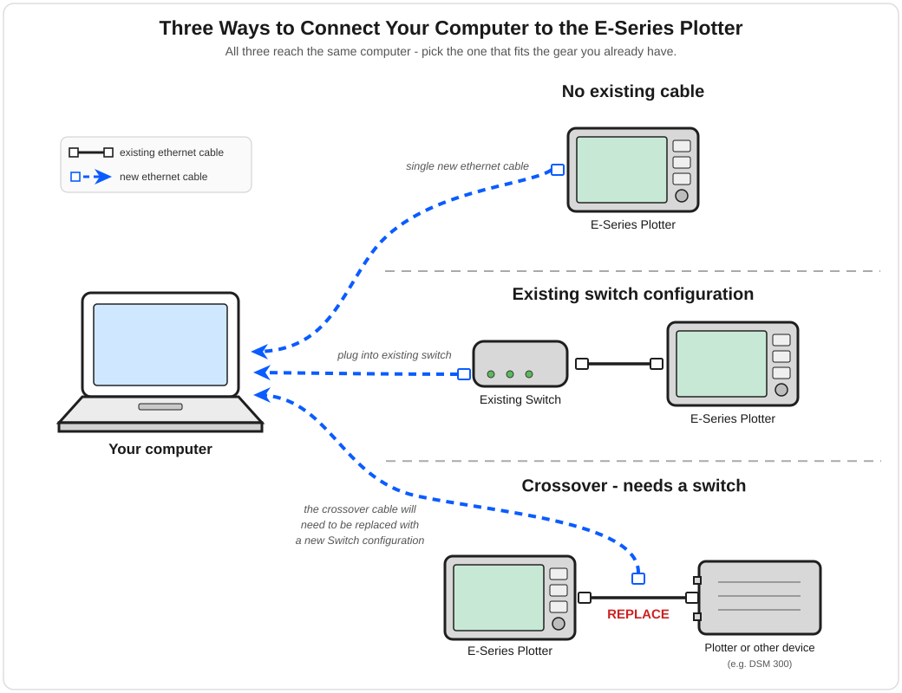
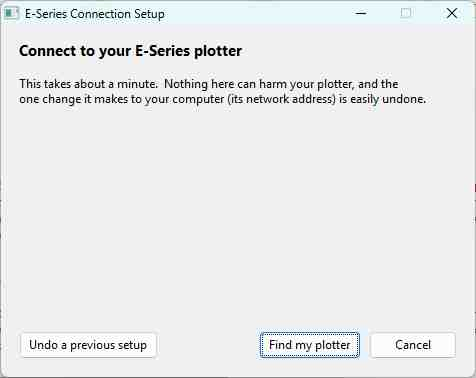

# navMate User Manual - Connecting an E-Series

**[Home](readme.md)** --
**[Getting Started](getting_started.md)** --
**[The Map](the_map.md)** --
**[Organizing Data](organizing_your_data.md)** --
**[Copy, Cut & Paste](copy_cut_paste.md)** --
**[Multi-Editor](winMultiEditor.md)** --
**[Import & Export](import_export.md)** --
**[FSH Files](winFSH.md)** --
**Connecting an E-Series** --
**[Using Your E-Series](using_eseries.md)** --
**[OpenCPN](opencpn.md)**

Everything so far works with navMate on its own. This chapter, and the next, are for owners of
a Raymarine **E-Series** plotter (E80 / E120) who want navMate and the plotter to talk to each
other. If you do not have one, you can skip both.

**Important Note:** *navMate has been tested with **v5.52** of the Raymarine firmware, and
exhaustivly tested with the only still available Raymarine
[**v5.69 firmware**](https://www.raymarine.com/en-us/download/e-series-classic-software) and the
[**custom v5.73 firmware**](custom_firmware.md) you can produce from navMate.
**navMate may not work with earlier versions of Raymaine firmware**, and
so, if you're on firmware older than 5.52, we recommend upgrading your plotter to 5.69 or 5.73 if you wish to use it with navMate.*

Connecting is a one-time setup: a cable between your computer and the plotter, and a short
network step that navMate helps you through.

## The three ways to connect

How you connect depends on the gear you already have. There are three common situations -- all
of which end with your computer talking to the plotter:

- **No existing cable** -- the simplest case. Run a single standard Ethernet cable straight from
  the plotter to your computer. Modern computers sort out the wiring automatically, so an
  ordinary "straight-through" cable is all you need.
- **Existing switch** -- if your boat already has a network (most often the old Raymarine
  network switch), plug both the plotter and your computer into it; they find each other
  through it.
- **Crossover cable** -- if you have an old *crossover* cable left over from wiring two marine
  devices directly together, replace it with a standard cable and a switch. The diagram marks
  this case so you know to swap it out.

> **Use a plain switch -- not a Wi-Fi router.** For the switch above, an inexpensive *unmanaged*
> Ethernet switch (or the old Raymarine one) is the safe choice. A **Wi-Fi router**, or a
> "smart"/managed switch, can quietly filter out the plotter's network traffic -- the plotter then
> seems to vanish from navMate, and on a boat with a second (repeater) display it can cut that
> display's navigation feed from the master plotter. If a plotter that was working suddenly goes
> blank, suspect a Wi-Fi router or managed switch in the path first. (The technical cause is *IGMP
> snooping*, a form of multicast filtering that a plain switch does not do.)

## The network step

A plotter and a computer will not talk until they are on the same network "address range," and
setting that up by hand is fiddly. navMate includes the **E-Series Network Wizard** to do it for
you: it listens for your plotter on the cable, reads its address, and puts your computer's network
adapter onto the matching range -- so there are no IP numbers to puzzle over.

You can run the wizard whichever way is handiest:

- At the end of **installation**, tick "Run the network wizard now" on the final screen.
- Anytime, from the **Start menu or the desktop**
 icon.
 for the network wizard.
- From inside navMate, via **Utils -> E-Series Network Wizard**.

Because it adjusts a Windows network setting, the wizard asks for administrator permission when
it starts -- click **Yes** at the Windows prompt. Then just follow its steps: it searches for your
plotter, sets up the connection, and tells you when it is done.

## Confirming the connection

Open the **ESeries window** with **View -> ESeries**. Once your computer and the plotter are on the same
network, the plotter's own waypoints, routes, groups, and tracks appear there, ready to work
with -- which is the subject of the [next chapter](using_eseries.md). If the window is empty, choose
**ESeries -> Refresh ESeries Database** to read the plotter's current contents.

> **Tip:** make sure the plotter is powered on and fully started up before you connect -- give it
> the minute or so it needs to finish booting.

**Next:** [Using Your E-Series](using_eseries.md)
