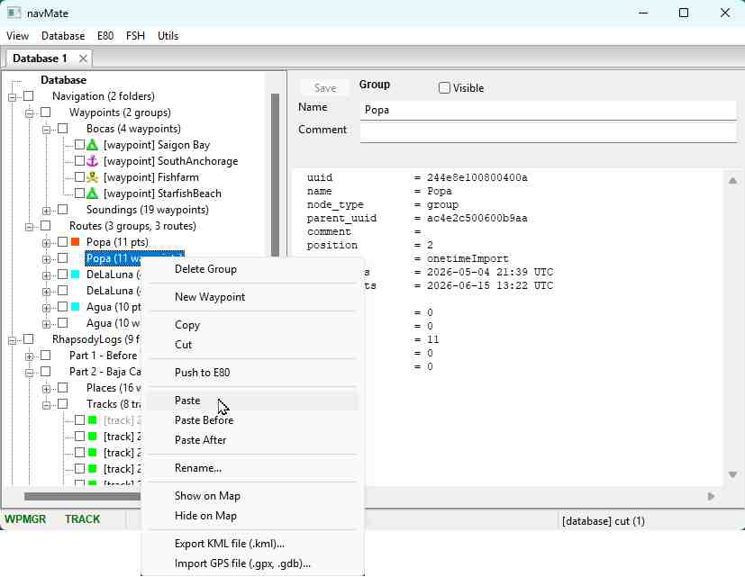

# navMate User Manual - Copy, Cut & Paste

**[Home](readme.md)** --
**[Getting Started](getting_started.md)** --
**[The Map](the_map.md)** --
**[Organizing Data](organizing_your_data.md)** --
**Copy, Cut & Paste** --
**[Multi-Editor](winMultiEditor.md)** --
**[Import & Export](import_export.md)** --
**[FSH Files](winFSH.md)** --
**[Connecting an E-Series](connecting_e80.md)** --
**[Using Your E-Series](using_e80.md)**

navMate lets you reorganize your data with the same **copy, cut, and paste** you use
everywhere else. Right-click almost anything in a tree and you get a menu of the operations
that make sense for it.

## The basics

- **Copy** makes a duplicate. When you paste it, you get a brand-new, independent copy.
- **Cut** moves. The original is removed once it lands successfully at its destination.
- **Paste** drops what you copied or cut into the folder you right-clicked.
- **New** creates a fresh waypoint, route, group, or branch.
- **Delete** removes the selected item, after a confirmation.

You can select many items at once -- hold **Ctrl** to pick individual items or **Shift** to
pick a range -- and operate on all of them together.

## Paste, Paste New, and paste position

When you paste, navMate offers a few variants so you land things exactly where you want them:

- **Paste** puts the items into the folder you clicked.
- **Paste New** does the same but forces brand-new copies, even of something you cut.
- **Paste Before** / **Paste After** drop the items right above or below the item you clicked.

Pasted items appear at the **top** of the destination folder, so you can see right away that
the paste worked without scrolling.

## Reordering a route

A route is just an ordered list of waypoints, and you reorder it with the same gestures:
**cut** a waypoint inside the route and **paste before / after** another one to move it. You
can also copy waypoints from anywhere in your database and paste them into a route to extend
it.

## Renaming many at once

When you select several waypoints (or routes, or tracks) of the same kind, the menu offers
**Rename...**, which renames them in a numbered series -- for example `Mooring 01`,
`Mooring 02`, `Mooring 03` -- from a single pattern.

## The same gesture sends to your plotter

Here is the nice part: when you connect a Raymarine E-Series, its waypoints, routes, and
tracks show up in their own window right next to your database. Copying from one window and
pasting into the other is exactly how you send data to the plotter and bring it back -- there
is no separate "export to plotter" command to learn. That cross-device workflow has its own
chapter, [Using Your E-Series](using_e80.md).

**Next:** [Multi-Editor](winMultiEditor.md)
