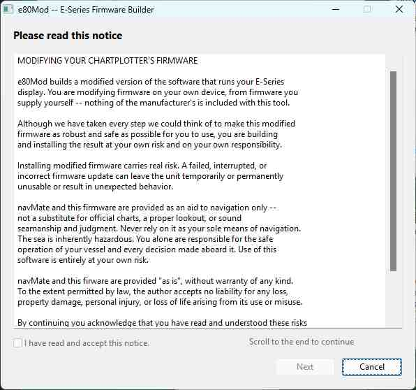

# navMate User Manual - Custom Firmware

**[Home](readme.md)** --
**[Using Your E-Series](using_eseries.md)**

navMate can build a small, optional **custom firmware** for your Raymarine E-Series (E80 / E120)
plotter. Installing it unlocks three extra conveniences in navMate -- saving and restoring the
plotter's display configuration, capturing the plotter's screen, and recording timed tracks (see
[Using Your E-Series](using_eseries.md)) -- that the stock Raymarine software does not provide.

This is entirely optional, and it is free. You do not need to modify your plotter to use navMate
for everything else; the custom firmware only adds those three features.

> **Please read this first.** Modifying and re-flashing a chartplotter's firmware carries real
> risk -- a failed or interrupted update can leave the unit unusable. We have taken great care to
> make the change safe and reversible, but **you do this on your own hardware, at your own risk and
> on your own responsibility.** If you are not comfortable with that, you can skip this chapter
> entirely; everything else in navMate works fine on a stock plotter.

## How it works, in plain terms

navMate never carries any of Raymarine's software. Instead:

1. **You** download Raymarine's own E-Series firmware (it is a free download from Raymarine).
2. navMate's **e80Mod** tool makes a modified *copy* of it on your computer -- a quick, offline
   file operation that never touches your plotter.
3. **You** copy the modified firmware onto a CF card and install it on the plotter the normal way,
   exactly like any Raymarine software update.

Because you supply your own firmware and install it yourself, you stay in control of every step.

## What you will need

- Your E80 / E120 plotter.
- A **CF card**, and a card reader for your computer.
- Raymarine's official **E-Series Classic** software (the free download below).

## Before you start: get your plotter onto v5.69

This is the one thing worth doing carefully. The custom firmware is built from Raymarine's **v5.69**
release, and installs as version **v5.73**.

**Our recommendation:** if your plotter is not already running v5.69, first update it to stock
**v5.69** using Raymarine's own instructions, and confirm it runs normally. *Then* install the
custom firmware. Done in that order, the custom firmware needs **no reset**, and your waypoints,
routes, and settings are kept.

In particular, avoid doing a **factory reset** unless Raymarine's own procedure truly requires one
for your starting version -- a factory reset erases all of your waypoints, routes, and
configuration on the unit.

## Step 1 -- Download the Raymarine firmware

Download the E-Series Classic software from Raymarine here:

**https://www.raymarine.com/en-us/download/e-series-classic-software**

You will get a **.zip** file. **Unzip it.** Inside you will find two files:

- `autorun.dob` -- Raymarine's installer (you will need this, unchanged).
- `E_App_Upg_Uni.pkg` -- the firmware package that navMate will modify.

## Step 2 -- Build the custom firmware

Open **e80Mod** from navMate's menu: **Utils -> E-Series Firmware**. You can also run it on its own with the
 icon.



It walks you through a few short steps:

1. **Read and accept the notice.** Scroll to the bottom, tick the box, and click Next.
2. **Choose your firmware.** Click **Browse** and select the `E_App_Upg_Uni.pkg` file you unzipped.
3. **Builder handle (optional).** Type a short name or tag here if you like -- letters, numbers,
   `-` and `.`, up to 15 characters, no spaces. It is shown on your plotter's **Unit Info** screen,
   so you can confirm at a glance that *your* build is installed. Leave it blank to use `navMate`.
4. **Output folder.** This defaults to the same folder as your firmware; change it if you prefer.
5. Click **Build.**

In a few seconds navMate writes the finished file, named **`E_App_Upg_Uni.mod003.pkg`**, into your
output folder. (navMate names it for you, so it can never overwrite Raymarine's original.)

> If e80Mod tells you the file *"does not appear to be valid v5.69 firmware,"* you most likely
> picked the wrong file, or a firmware version other than v5.69. Download v5.69 fresh from the
> Raymarine link above and try again.

## Step 3 -- Put it on a CF card

Copy **three** files to a CF card:

```
autorun.dob                Raymarine's installer (from the download, unchanged)
E_App_Upg_Uni.mod003.pkg   the custom firmware you just built
E_App_Upg_Uni.pkg          Raymarine's original (keep it -- this is your way back)
```

Keeping the original `E_App_Upg_Uni.pkg` on the card is what lets you return to stock at any time.

## Step 4 -- Install it on the plotter

Install it exactly like any Raymarine software update -- put the CF card in the unit and start it so
its installer runs. The installer lists every firmware package it finds on the card, so you simply
choose which one to install:

- Choose **`E_App_Upg_Uni.mod003.pkg`** (it shows as version **v5.73**) to install the custom
  firmware.
- Choose **`E_App_Upg_Uni.pkg`** (version **v5.69**) to put Raymarine's original firmware back.

Follow Raymarine's normal on-screen update procedure for the flashing itself.

When the unit comes back up, open its **Unit Info** screen: you should see version **v5.73** and, if
you entered one, your **builder handle**. (You can also confirm this from navMate itself, without
touching the plotter, with **ESeries -> About ESeries** -- see [Using Your E-Series](using_eseries.md).)

## Going back to stock

Because you kept Raymarine's original `E_App_Upg_Uni.pkg` on the card, you can revert whenever you
like: run the installer again and choose that original package. The unit returns to stock **v5.69**.

One limit to know: reverting takes you back to **v5.69** -- the version you downloaded -- not to some
other, older firmware you might have been running before.

**Back to:** [Using Your E-Series](using_eseries.md)
