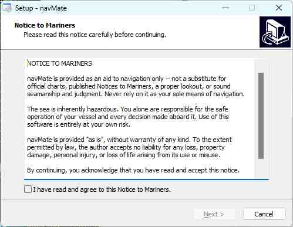
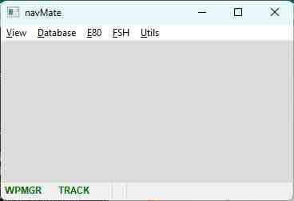
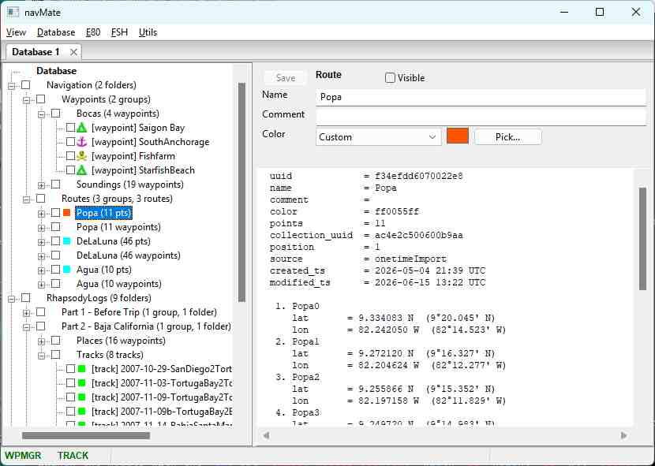

# navMate User Manual - Getting Started

**[Home](readme.md)** --
**Getting Started** --
**[The Map](the_map.md)** --
**[Organizing Data](organizing_your_data.md)** --
**[Copy, Cut & Paste](copy_cut_paste.md)** --
**[Multi-Editor](winMultiEditor.md)** --
**[Import & Export](import_export.md)** --
**[FSH Files](winFSH.md)** --
**[Connecting an E-Series](connecting_eseries.md)** --
**[Using Your E-Series](using_eseries.md)** --
**[OpenCPN](opencpn.md)**

This chapter gets navMate onto your computer and takes you on a first look around. You do
**not** need a chartplotter connected for any of this -- navMate is fully useful on its own.
Connecting an E-Series plotter comes later, in [its own chapter](connecting_eseries.md).

## 1. Install navMate

Download the installer from the
**[navMate Releases page](https://github.com/phorton1/base-apps-navMate/releases)** -- grab
the installer from the most recent release at the top of the list. Then run it and follow the
prompts. Everything navMate needs is included -- you do not need to install Perl or any other
software first.

The first time it runs, navMate creates a folder for your data under your Windows **Documents**
folder, at `Documents\phorton1\navMate`. Your entire knowledge base lives in a single database
file there (`navMate.db`), which makes it easy to find and easy to back up: copy that one file
and you have copied everything.

The installer places four icons on your desktop:

-  -
  run *navMate*
-  -
  run navMate with a debugging **console window**
-  -
  run the **Network Wizard** to find your E-Series chartplotter
-  -
  run the **Custom Firmware Builder** to create new firmware for your
  E-Series plottor to enable new capabilities

## 2. First run

Click the  icon to launch navMate,
then select the **View - Database** menu item to open the *Database Window*.

You may then click on the **+** indicators in the outline to expand them, and
click on the Waypoints, Groups, Routes, and Tracks to see information about them
and edit them in the right side of the database window:

The [**map**](the_map.md) does not open on its own. It opens in your web browser as soon as you
**double click** on something in the outline or use the  **View -> Open Map** menu item.
Once the map is open, tick the checkbox next to anything in the tree and it appears on the map.
That is the whole loop -- organize on the left, see it on the right -- and it works with no boat, no plotter,
and no network in sight.

On a brand-new install the database starts with an example database containing a
variety of folders, Waypoints, Groups, Routes, and Tracks.

Feel free to explore it!

## 3. Import Your own Data

Although there is plenty of data in the example database to play around with,
there are also a variety of ways for you to bring your own data into navMate:

- if you have a **ARCHIVE.FSH** from an existing E-Series plotter, use **FSH - Open File**
  to open it in an *FSH Window*.
- If you use **Google Earth**, export a `.kml` file and choose **Database -> Import KML**. (See
  [Import & Export](import_export.md) for what comes in cleanly.)
- If you have a **GPS file** (`.gpx/.gdb`) from another device or app, right-click a folder in the
  database tree and choose **Import GPS file**.

Feel free to try any command at any time.  If you ever want to return to the original
example database, use the **Database - Import from Text** command to recreate the
example database from the **example_database.txt** file in your
*\My Documents\phorton1\navMate folder.

**Next:** [The Map](the_map.md)
