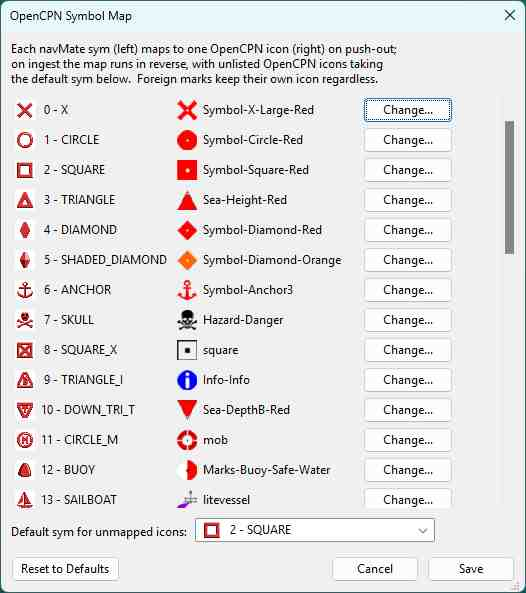

# navMate User Manual - OpenCPN

**[Home](readme.md)** --
**[Getting Started](getting_started.md)** --
**[The Map](the_map.md)** --
**[Organizing Data](organizing_your_data.md)** --
**[Copy, Cut & Paste](copy_cut_paste.md)** --
**[Multi-Editor](winMultiEditor.md)** --
**[Import & Export](import_export.md)** --
**[FSH Files](winFSH.md)** --
**[Connecting an E-Series](connecting_eseries.md)** --
**[Using Your E-Series](using_eseries.md)** --
**OpenCPN**

This chapter focuses on how you move data through navMate's own **OpenCPN window** and **OpenCPN menu**.

[OpenCPN](https://opencpn.org) is a free, open-source chart plotter that runs on your computer.
navMate treats it as a **spoke**, exactly like the E-Series: **fill OpenCPN with waypoints and
routes from your navMate collection** before a trip, and **file OpenCPN's own marks and tracks back
into navMate** afterward, with navMate always the permanent home of record.
To use OpenCPN within navMate you must install the **oESeries** plugin into your instance of OpenCPN.

Please see **[Getting Started](https://github.com/phorton1/src-OpenCPN-oESeries/blob/master/docs/getting_started.md)**
for complete instructions on how to do that.

## The OpenCPN window

Open it with **View -> OpenCPN**. Like the ESeries window, it shows a live view of what is currently
in OpenCPN -- its marks, routes, and tracks -- right next to your database window, so you can see
both at once.

The OpenCPN window is a **view onto OpenCPN**: changes you make through it are sent out to OpenCPN.
As always, nothing is added to your permanent database until *you* copy something across into it.

## Sending and bringing back

You move data exactly the way you do with the E-Series -- with the same [copy and
paste](copy_cut_paste.md), no separate transfer command:

- **Fill OpenCPN** -- copy waypoints, routes, or tracks in your database window and paste them into
  the OpenCPN window.
- **Archive from OpenCPN** -- copy marks or tracks in the OpenCPN window and paste them into a folder
  in your database.

It is easiest when you can see both windows at once. You can dock them side by side, or drag one out
into its own floating window -- see [Copy, Cut & Paste](copy_cut_paste.md).

## What travels cleanly -- and what does not

The connection is built to **populate OpenCPN from your archive** and **bring OpenCPN's geometry
back**, and it does both faithfully:

- **New waypoints, routes, and tracks** you send to OpenCPN arrive complete.
- **Marks (waypoints)** move back and forth safely, keeping their details.
- **Bringing OpenCPN's marks and tracks into navMate** is faithful -- and navMate remembers where
  they came from, so sending them back out later re-uses their original identity instead of making
  duplicates.

There is one honest limitation. When you **edit an existing route or track in place** through the
connection, some OpenCPN-only styling can be lost -- a route's line color and style, for example.
This is a known trade-off of working through OpenCPN's plugin interface, and it is safe: your navMate
copy is the record and never loses anything. The plugin's own page documents the exhaustive
per-field detail if you want it:
**[plugin limitations](https://github.com/phorton1/src-OpenCPN-oESeries/blob/master/docs/notes/OpenCPN_Plugin_Limitations.md)**.

(One small display note: in the OpenCPN window a mark's *scale-max* value is shown greyed, because
OpenCPN's own update path does not carry it.)

## The OpenCPN menu: matching symbols to icons

navMate marks carry navMate's own **symbols**; OpenCPN marks carry OpenCPN's own **icons** -- two
different sets. **OpenCPN -> Symbol Map...** opens a small table where you set how the two line up:
which OpenCPN icon each navMate symbol becomes when you push a mark out, and which navMate symbol an
incoming OpenCPN icon becomes when you bring one in (with a single catch-all symbol for any OpenCPN
icon you have not mapped).

The defaults are sensible, so most people never open it -- but it is there
when you want a pushed mark to show a particular icon on the OpenCPN chart, or want incoming icons
sorted to symbols of your choosing. Your changes are saved and used for every push and ingest
afterward.

**Next:** [Home](readme.md)
