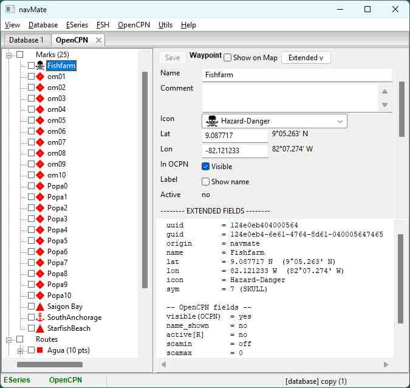

# navMate User Manual - OpenCPN

**[Home](readme.md)** --
**[Getting Started](getting_started.md)** --
**[The Map](the_map.md)** --
**[Organizing Data](organizing_your_data.md)** --
**[Copy, Cut & Paste](copy_cut_paste.md)** --
**[Multi-Editor](winMultiEditor.md)** --
**[Import & Export](import_export.md)** --
**[FSH Files](winFSH.md)** --
**[Connecting an E-Series](connecting_eseries.md)** --
**[Using Your E-Series](using_eseries.md)** --
**OpenCPN**

[OpenCPN](https://opencpn.org) is a free, open-source chart plotter that runs on your computer --
a full navigation program with charts, AIS, and a live GPS feed. navMate works happily alongside
it: **fill OpenCPN with waypoints and routes from your navMate collection** before a trip, and
**file OpenCPN's own marks and tracks back into navMate** when you are done. If you do not use
OpenCPN, you can skip this chapter.

Like the E-Series, OpenCPN is a **spoke**: navMate stays the permanent home of record, and OpenCPN
is one more place your data can visit. navMate does not try to replace OpenCPN's live navigation --
it brings the lifelong, organized knowledge base that OpenCPN, like any plotter, does not keep.

## What you need: the oESeries plugin

navMate talks to OpenCPN through a small companion **plugin** called **oESeries**. It is free and
open-source, and it installs into OpenCPN the same way any OpenCPN plugin does. You install it once.

Get the plugin, and its installation instructions, from its own page:
**[the oESeries plugin](https://github.com/phorton1/src-OpenCPN-oESeries/blob/master/docs/readme.md)**.

**TODO:** 

## Pointing the plugin at navMate

The plugin finds navMate over your computer's own network connection, using an **address** you give
it. navMate shows you exactly what to enter: open **Help -> About navMate** and read the **navMate
server** address there.

**TODO:** 

navMate lists one line for each way it can be reached:

- **Local** -- use this when OpenCPN is running on the **same computer** as navMate. This is the
  simplest case, and by far the most common. The address is always `127.0.0.1` followed by a port
  number (for example `127.0.0.1:9873`).
- **Wi-Fi / Ethernet** -- use one of these when OpenCPN is on a **different computer** on your boat's
  network (say a second laptop, or a Raspberry Pi). Pick the line for the network the two computers
  share.

Type the address into the plugin's settings **exactly as shown** -- all the numbers, including the
`:` and the number after it.

**TODO:** 

> Enter the address as the actual numbers navMate shows you (for example `127.0.0.1:9873`), not the
> word "localhost" -- navMate answers on the numeric address.

## If OpenCPN is on a different computer: Windows Firewall

If OpenCPN and navMate are on the **same computer**, there is nothing to set up here -- skip this
section.

If OpenCPN is on a **different computer** and it cannot reach navMate, Windows Firewall on the
navMate computer is the usual reason -- it guards against unexpected connections from the network.
navMate's installer already opens the door for a Raymarine-style boat network (the `10.x` address
range), so if your network uses those addresses it simply works. If your network uses a different
range (such as `192.168.x`), allow **navMate** through **Windows Defender Firewall** for your local
(Private) network and try again. It is a one-time permission, and easily undone.

(A remote OpenCPN computer connects to the *navMate computer*, not to your E-Series -- it only needs
to reach navMate across whatever network the two computers share.)

## The OpenCPN window

Open it with **View -> OpenCPN**. Like the ESeries window, it shows a live view of what is currently
in OpenCPN -- its marks, routes, and tracks -- right next to your database window, so you can see
both at once.

**TODO:** 

The OpenCPN window is a **view onto OpenCPN**: changes you make through it are sent out to OpenCPN.
As always, nothing is added to your permanent database until *you* copy something across into it.

## Sending and bringing back

You move data exactly the way you do with the E-Series -- with the same [copy and
paste](copy_cut_paste.md), no separate transfer command:

- **Fill OpenCPN** -- copy waypoints, routes, or tracks in your database window and paste them into
  the OpenCPN window.
- **Archive from OpenCPN** -- copy marks or tracks in the OpenCPN window and paste them into a folder
  in your database.

It is easiest when you can see both windows at once. You can dock them side by side, or drag one out
into its own floating window -- see [Copy, Cut & Paste](copy_cut_paste.md).

## What travels cleanly -- and what does not

The connection is built to **populate OpenCPN from your archive** and **bring OpenCPN's geometry
back**, and it does both faithfully:

- **New waypoints, routes, and tracks** you send to OpenCPN arrive complete.
- **Marks (waypoints)** move back and forth safely, keeping their details.
- **Bringing OpenCPN's marks and tracks into navMate** is faithful -- and navMate remembers where
  they came from, so sending them back out later re-uses their original identity instead of making
  duplicates.

There is one honest limitation. When you **edit an existing route or track in place** through the
connection, some OpenCPN-only styling can be lost -- a route's line color and style, for example.
This is a known trade-off of working through OpenCPN's plugin interface, and it is safe: your navMate
copy is the record and never loses anything. The plugin's own page documents the exhaustive
per-field detail if you want it:
**[plugin limitations](https://github.com/phorton1/src-OpenCPN-oESeries/blob/master/docs/notes/OpenCPN_Plugin_Limitations.md)**.

(One small display note: in the OpenCPN window a mark's *scale-max* value is shown greyed, because
OpenCPN's own update path does not carry it.)

**Next:** [Home](readme.md)
