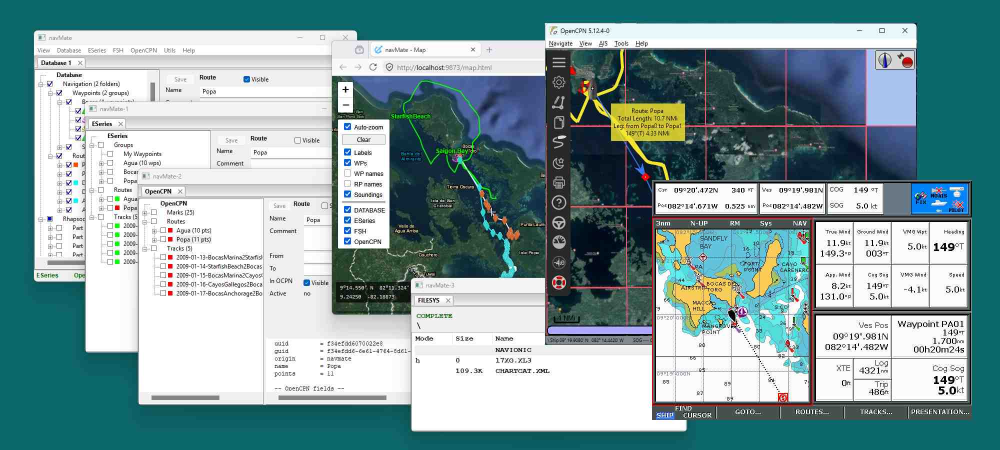

# navMate User Manual

**Home** --
**[Getting Started](getting_started.md)** --
**[The Map](the_map.md)** --
**[Organizing Data](organizing_your_data.md)** --
**[Copy, Cut & Paste](copy_cut_paste.md)** --
**[Multi-Editor](winMultiEditor.md)** --
**[Import & Export](import_export.md)** --
**[FSH Files](winFSH.md)** --
**[Connecting an E-Series](connecting_eseries.md)** --
**[Using Your E-Series](using_eseries.md)** --
**[OpenCPN](opencpn.md)**

Welcome aboard. **navMate** is the home for your navigation knowledge -- the waypoints,
groups, routes, and tracks you accumulate over a lifetime of boating, across every boat
you own and every chartplotter you use.

Your chartplotter is built for the passage you are on right now. It holds the dozens of
marks that matter for this region, this trip. navMate is built for the other scale
entirely: the thousands of waypoints, the years of tracks, the anchorages and hazards and
favorite spots you have learned over decades. That knowledge does not belong to any one
device -- and in navMate it never gets lost when you upgrade a plotter or change boats.

## What navMate does well

navMate is, first and foremost, an **organizer**. It lets you keep a large amount of
navigation data in a hierarchy *you* design -- folders within folders, by ocean, by season,
by boat, however you think about your sailing -- and rearrange it with the **copy, cut, and
paste** you already know from every other program you use. That sounds simple, but no
chartplotter -- and no other program we know of -- lets you manage waypoints, groups, routes,
*and* tracks this way, at this scale.

navMate works completely on its own; you do not need a chartplotter connected to use it.
When you *do* have a Raymarine E-Series (E80 / E120) plotter, navMate connects to it and
becomes the place you plan trips before you leave the dock and file away everything new when
you return. It also reads and writes the file formats you already use: Google Earth (KML),
other GPS devices and apps (GPX), and Raymarine / Navionics chart-card archives (FSH). And if you
navigate with **OpenCPN** on your computer, navMate can fill it from your collection and bring its
marks and tracks back.

## Contents

- **[Getting Started](getting_started.md)** -- install navMate and take your first look
  around, no plotter required.
- **[The Map](the_map.md)** -- see your waypoints, routes, and tracks on a
  satellite map.
- **[Organizing Data](organizing_your_data.md)** -- the database window: build your own
  hierarchy of folders, waypoints, routes, and tracks.
- **[Copy, Cut & Paste](copy_cut_paste.md)** -- move and duplicate your data the easy way.
- **[Multi-Editor](winMultiEditor.md)** -- change a property on many items at once.
- **[Import & Export](import_export.md)** -- Google Earth (KML) and GPS files (GPX).
- **[FSH Files](winFSH.md)** -- open and edit Raymarine / Navionics chart-card archives.
- **[Connecting an E-Series](connecting_eseries.md)** -- wire up and network your E80 / E120.
- **[Using Your E-Series](using_eseries.md)** -- send a trip out, bring your tracks back, and
  manage the plotter itself.
- **[OpenCPN](opencpn.md)** -- fill OpenCPN from your archive and file its marks and tracks back.

**Next:** [Getting Started](getting_started.md)
