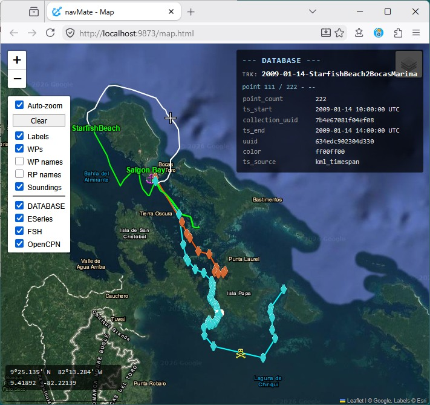

# navMate User Manual - The Map

**[Home](readme.md)** --
**[Getting Started](getting_started.md)** --
**The Map** --
**[Organizing Data](organizing_your_data.md)** --
**[Copy, Cut & Paste](copy_cut_paste.md)** --
**[Multi-Editor](winMultiEditor.md)** --
**[Import & Export](import_export.md)** --
**[FSH Files](winFSH.md)** --
**[Connecting an E-Series](connecting_eseries.md)** --
**[Using Your E-Series](using_eseries.md)** --
**[OpenCPN](opencpn.md)**

navMate shows your navigation data on a **map** -- an interactive, satellite-imagery
view that opens in your web browser right alongside the application windows.

- **Waypoints** appear as small symbols -- the same anchor, hazard, fish, and marker icons
  your E-Series uses.
  - A waypoint set up as a *label* shows its name as text
  - A waypoint set up as a *sounding* shows its depth
- **Routes** are drawn as solid colored lines connecting their waypoints in the order you'll travel them.
- **Tracks** -- the breadcrumb trail of where the boat actually went -- are drawn as solid
  colored lines.

Folders are not drawn on the map; only the waypoints, routes, and tracks inside them are.

## Opening the map

The map does not open on its own when navMate starts. It opens the first time you put
something on it: **double-click** any item in the database, ESeries, or FSH tree -- or tick its
checkbox -- and the map opens in your web browser showing that item. You can also open it at
any time with **View -> Open Map**. It runs locally on your own computer -- navMate does not
need an internet connection to work, though the satellite imagery itself is fetched online
when you are connected.

## What you see on the map

The map has a few on-screen controls:

- **Zoom** with the + / - buttons (top-left) or the mouse wheel.
- **Base imagery** -- the small control at the **top-right** switches the underlying
  satellite/terrain map.
- A **Display Panel** at the top-left controls what is drawn:
  - **Auto-zoom** (on by default) re-frames the map to fit whatever you've just shown --
    double-clicked, ticked, or sent over with **Show on Map**. Turn it off to keep your view
    put while you toggle things.
  - **Clear** empties the map and unticks every display checkbox in the app at once.
  - the kind toggles show or hide whole categories of marks: the waypoint icons (**WPs**) and
    their names (**WP names**), the names on route points (**RP names**), and the text-label
    (**Labels**) and depth-sounding (**Soundings**) marks.
  - **DATABASE / ESeries / FSH** show or hide everything from each data store -- handy for comparing
    what's on the plotter against what's in your database.
- A **coordinates readout** in the lower-left shows the latitude/longitude under the pointer.
- **Hover for details** -- rest the pointer on any mark, route, or track and a panel at the
  upper-right shows its details from the database.

In the map above, the pointer is resting on the **2009-01-14-StarfishBeach2BocasMarina**
track -- which is why it is drawn in white (a hovered track or route highlights so you can
pick it out of a crowded screen) and why its card is open at the upper-right. The card reads
the whole trip straight from the database: a 222-point run that started at 10:00 UTC and
ended at 14:00 UTC on 14 January 2009 -- a four-hour daysail through the Bocas del Toro
archipelago, from Starfish Beach to Bocas Marina, recorded breadcrumb by breadcrumb.

## Showing and hiding things

The map does not show everything at once -- it shows what you have **checked** in the tree
windows. Every item has a checkbox:

- Tick a waypoint, route, or track and it appears on the map immediately.
- Tick a folder and everything inside it appears.
- Un-tick to hide. **View -> Clear Map** hides everything at once.

This is how you focus: check just the region or the trip you care about, and the map shows
only that. navMate remembers what was visible from one session to the next.

## Editing on the map

When you select a track or route, navMate lets you adjust it directly on the map -- drag a
point, insert or delete points, trim or split a track. This is handy for tidying up a recorded
track or fine-tuning a planned route by eye against the satellite image.

**Next:** [Organizing Data](organizing_your_data.md)
