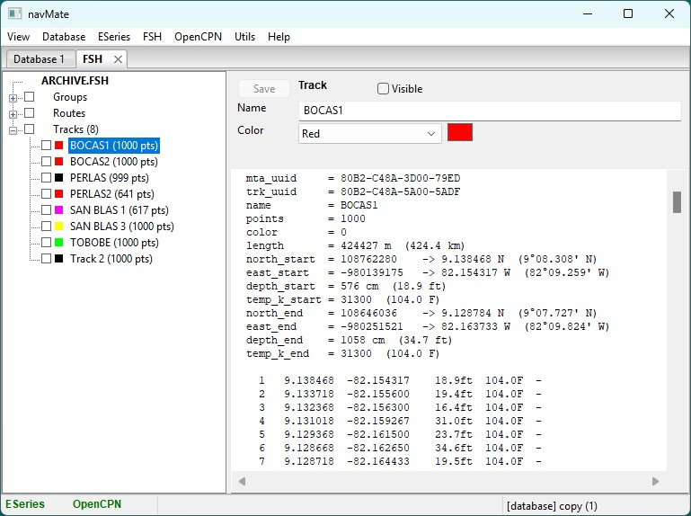

# navMate User Manual - FSH Files

**[Home](readme.md)** --
**[Getting Started](getting_started.md)** --
**[The Map](the_map.md)** --
**[Organizing Data](organizing_your_data.md)** --
**[Copy, Cut & Paste](copy_cut_paste.md)** --
**[Multi-Editor](winMultiEditor.md)** --
**[Import & Export](import_export.md)** --
**FSH Files** --
**[Connecting an E-Series](connecting_eseries.md)** --
**[Using Your E-Series](using_eseries.md)** --
**[OpenCPN](opencpn.md)**

If you have used a Raymarine plotter with a Navionics or compatible chart card, your waypoints,
routes, and tracks are stored on that card in an **FSH archive** -- a single file (`.fsh`) that
holds them all. navMate can open these files directly, let you browse and edit what is inside,
and save them back.

## Opening an FSH file

Choose **FSH -> Open File...** and pick a `.fsh` file. navMate loads it into its own **FSH
window**, which looks and behaves just like the database window: a tree of groups, routes, and
tracks on the left, an editor panel on the right.

## Editing in place

Click any item to edit its name, position, symbol, color, depth, and so on, the same way you do
in the database. Your changes are held **in memory** until you save -- nothing is written back
to the file until you ask:

- **FSH -> Save File** writes your changes back to the same file (with a confirmation, since it
  overwrites the card's data).
- **FSH -> Save File As...** writes to a new file, leaving the original untouched.

Because the chart-card format has tighter limits than navMate's own database (shorter names and
comments, a fixed palette of colors), navMate keeps those limits in view while you edit.

## Moving data between an FSH file and your database

The FSH window is a full member of navMate's copy-and-paste family. You can **copy items out of
an FSH file and paste them into your database** to absorb them into your permanent collection,
or copy from your database and paste into an FSH file you are preparing for a card. See
[Copy, Cut & Paste](copy_cut_paste.md).

## Converting tracks

Plotter tracks often arrive as one long multi-segment recording. **FSH -> Convert to navMate
Working Copy** splits each into separate, individually named single-segment tracks, which are
far easier to organize and edit. Save the file afterward to keep the result.

**Next:** [Connecting an E-Series](connecting_eseries.md)
