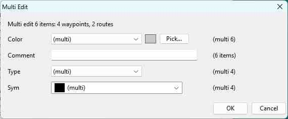

# navMate User Manual - Multi-Editor

**[Home](readme.md)** --
**[Getting Started](getting_started.md)** --
**[The Map](the_map.md)** --
**[Organizing Data](organizing_your_data.md)** --
**[Copy, Cut & Paste](copy_cut_paste.md)** --
**Multi-Editor** --
**[Import & Export](import_export.md)** --
**[FSH Files](winFSH.md)** --
**[Connecting an E-Series](connecting_eseries.md)** --
**[Using Your E-Series](using_eseries.md)** --
**[OpenCPN](opencpn.md)**

Sometimes you want to change the same thing on a lot of items at once -- recolor every
waypoint in a group, give a batch of marks the same symbol, or clear the comment off a dozen
routes. The **Multi-Editor** does exactly that.

## When you can use it

Select two or more items of the editable kinds (waypoints, routes, or tracks) in the database
window or the [FSH window](winFSH.md), right-click, and choose **Multi Edit (N items)...**.

## What you can change

The Multi-Editor shows only the properties the selected items share. Depending on what you
picked, that may include:

- **color**,
- **comment**,
- **symbol** (for waypoints), and
- **type** (for waypoints).

Set the fields you want to change and leave the rest alone. When you apply, navMate writes the
change to every selected item in a single step -- so it either all takes effect or none of it
does, and your data is never left half-changed.

## A note on limits

When you are editing FSH items, navMate watches the chart-card format's limits (for example,
comments are capped in length). If something you typed will not fit, the Multi-Editor tells you
rather than quietly trimming it.

**Next:** [Import & Export](import_export.md)
